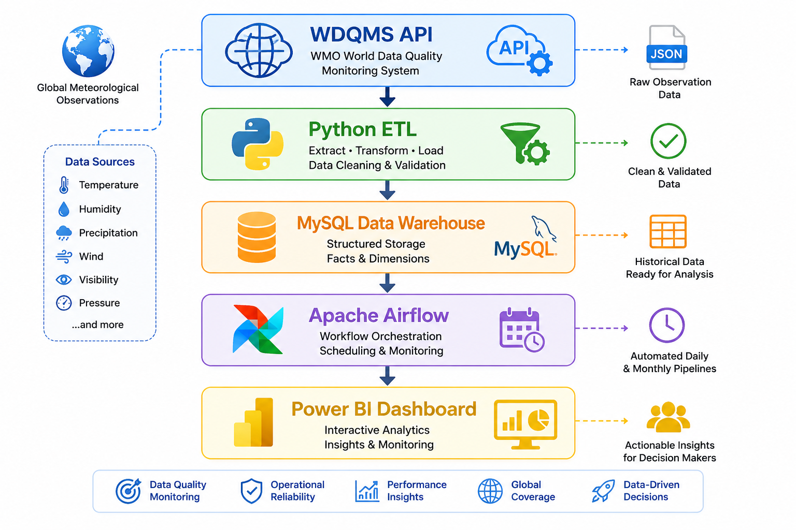
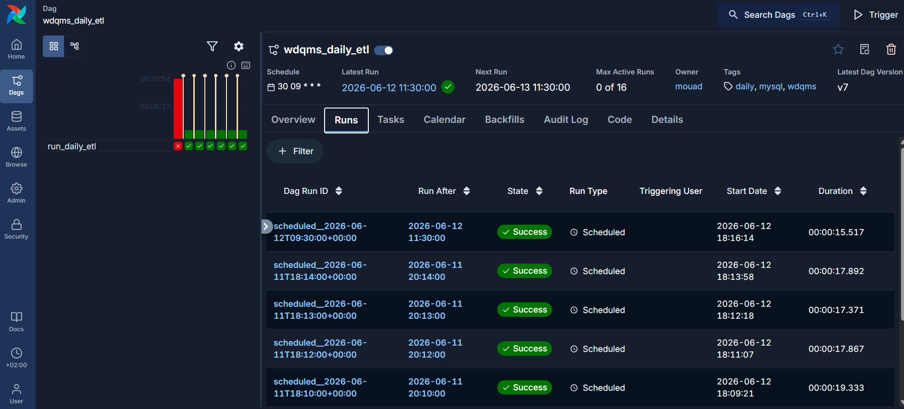

# 🌍 WDQMS Monitoring Platform

## Overview

The WDQMS Monitoring Platform is an end-to-end Data Engineering project designed to monitor the availability and quality of meteorological observations worldwide.

The platform automatically extracts observation data from the WMO WDQMS API, transforms and stores it in a MySQL data warehouse, orchestrates workflows using Apache Airflow, and delivers interactive monitoring dashboards through Power BI.

---

## Architecture



```text
WDQMS API
    ↓
Python ETL
    ↓
MySQL
    ↓
Apache Airflow
    ↓
Power BI
```

---

## Technologies

* Python
* Pandas
* NumPy
* MySQL
* Apache Airflow
* Docker
* Power BI
* Git

---

## Features

### Data Extraction

* Daily observation ingestion
* Monthly observation ingestion
* Automated API integration

### Data Transformation

* Data quality validation
* Availability rate calculations
* Country and station enrichment

### Data Storage

* Dimensional data warehouse
* Fact and dimension tables
* Historical monitoring

### Orchestration

* Daily Airflow pipeline
* Monthly Airflow pipeline
* Automated scheduling

### Dashboarding

* Global availability monitoring
* Country performance analysis
* Station-level monitoring
* Top problematic stations

---

## Dashboard

### Overview


---

## Database Model

### Dimensions

* dim_station
* dim_country

### Facts

* fact_daily_observations
* fact_monthly_observations

---

## Airflow

The project includes automated Airflow DAGs for daily and monthly data ingestion.



---

## Business Value

This platform enables meteorological organizations to:

* Monitor station reporting performance
* Detect availability issues
* Identify problematic stations
* Track observation quality globally

---

## Author

**Mouad Merrouchi**

Data Engineer

Microsoft Fabric | Python | SQL | Power BI | Apache Airflow | Azure
